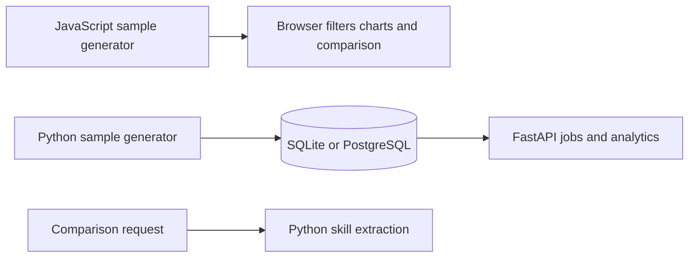

# Reviewing and running the job dashboard

## Execution modes

The frontend generates 240 synthetic job records in JavaScript and computes charts and skill comparison in the browser. This remains true when Nginx serves it through Docker Compose. The current `frontend/js/app.js` does not call the FastAPI jobs, analytics or comparison endpoints.

The Python API separately seeds and queries a database and implements skill comparison. Starting all three Docker services makes both demonstrations available, but does not connect the dashboard to the API. That connection requires a frontend code change.



## Setup

Python 3.12 matches the CI workflow. Run from the repository root:

```powershell
git clone https://github.com/Billalhossainshishir/australian-job-intelligence-dashboard.git
cd australian-job-intelligence-dashboard
py -3.12 -m venv .venv
.\.venv\Scripts\python.exe -m pip install -r requirements.txt
.\.venv\Scripts\python.exe -m backend.app.seed
.\.venv\Scripts\python.exe -m uvicorn backend.app.main:app --reload
```

Use a second terminal for `py -3.12 -m http.server 8080 --directory frontend`. Open `http://127.0.0.1:8080` for the browser demonstration and `http://127.0.0.1:8000/docs` for the backend.

Alternatively, run `docker compose up --build`. Compose seeds PostgreSQL before starting the API. Local Python defaults to SQLite; a different `DATABASE_URL` must be set in the process environment before seeding and starting the API. It does not automatically load a `.env` file.

## Check both implementations

1. On the dashboard, filter to a location and choose a role. Compare a short synthetic CV, then inspect the matched and missing skills.
2. In Swagger, call `/health`, `/jobs?limit=500`, `/locations` and `/analytics/top-skills` after seeding.
3. Call `POST /compare` with `cv_text` and `job_description`; inspect the returned matched/missing skills and coverage.
4. Do not use a successful browser interaction as evidence that PostgreSQL or the Python API was queried. Check API responses independently.

```powershell
.\.venv\Scripts\python.exe -m pytest -q
```

The suite covers health, comparison, dictionary normalisation and generated title/level consistency. It is not a browser-to-API integration test. Browser and Python extraction implementations should be compared before claiming exact parity.

## Meaning of the result

Technical Skill Coverage divides matched tracked skills by tracked skills requested in the role description. It is dictionary-based matching; it does not measure skill proficiency, years of experience, suitability or hiring probability. Negation and context need careful interpretation, and untracked skills are outside the metric.

The 240 roles, employer names, posting dates and salary ranges are generated examples. They support reproducible software demonstrations, not conclusions about Australian labour-market demand or actual employer vacancies.

## Next implementation work

Connect the frontend to the API, then add browser-to-API checks and shared comparison examples. Add real screenshots of the filter and comparison workflow; `screenshots/` currently contains instructions only. Keep those tasks separate from the current functionality described above.


## Recorded verification evidence

At documentation review, the existing [GitHub Actions test run](https://github.com/Billalhossainshishir/australian-job-intelligence-dashboard/actions/runs/35169496233) reported `success` for `b9caaf1269fc61eeb4bf585135584d4fd06d8f0d`. This records an existing CI result; the documentation review did not install dependencies or rerun the application locally. Commands above were checked against source files and configuration. A successful CI run does not establish production readiness or validate untested UI integrations.
