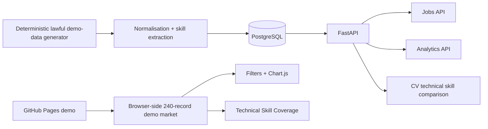

# Architecture

## Full-stack path

The repository contains FastAPI, SQLAlchemy and PostgreSQL. `docker compose up --build` starts PostgreSQL, seeds 240 deterministic demo records, starts the API and serves the frontend locally.

## GitHub Pages path

GitHub Pages is static hosting, so the public recruiter demo generates the same reproducible sample market in browser JavaScript. The page clearly labels the records as portfolio demo data and does not claim the Python backend is running on GitHub Pages.
